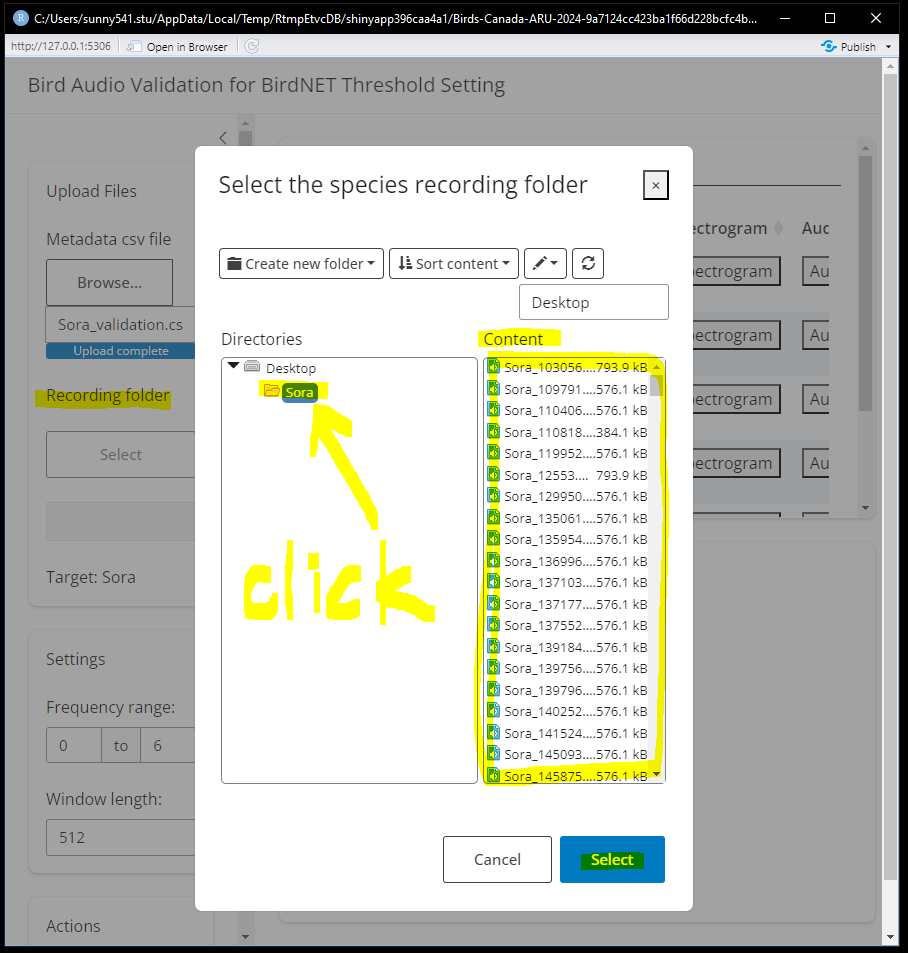

```{r setup, include=FALSE}
knitr::opts_chunk$set(echo = TRUE)
```

### Quick review

All validation datasets are stored in a [Google Drive](https://drive.google.com/drive/folders/1-oZjQ5xzwJOD9E9hcm_CSMku05FS9gKa?usp=sharing), organized by species in individual folders. There are 27 target species, although White-winged Scoter has no detections, so there are only 26 folders. Each species folder includes up to 180 recording segments (each 9 seconds long) and a .csv file named "SPECIES NAME_validation.csv" that serves as metadata for these segments. The segments are randomly selected from all detections for that species, stratified by confidence score. The validation task involves listening to each segment to verify if BirdNET correctly identified the species and writing down this information in the .csv file. To conduct species validation, follow these steps:

### Mark species

-   In the Google Drive main folder, open the "who_did_species_validation" file and add your name to indicate that you are validating a species (e.g., put my name down beside Sora).

    

### Get data folder

-   Download the whole folder for the species that you selected

<!-- -->

-   In the selected species folder, open the "SPECIES NAME_validation.csv" file. Add two new columns beside the category column labeled "validation" and "note."

    

<!-- -->

-   Listen to each recording and view the spectrogram if needed. If the BirdNET detection is accurate (e.g., Sora is present in the recording), enter "Y" in the validation column. If it is not accurate (e.g., no Sora was heard), enter "N."
-   Record notes on specific vocalizations (e.g., song, call, begging call) and/or possible reasons for misidentification (e.g., background noise, misidentified as XYZ species).
-   To avoid judgement bias, "hide" the confidence column by `right click > Hide`.

### Use ShinyR to listen/view spectrogram (optional)

-   Open RStudio, enter the following chunk of code.

```{r, eval = FALSE}

# use install.packages("PACKAGE_NAME") if you don't have any of the following required package

library(shiny) 
library(bslib)
library(shinyWidgets) 
library(shinyFiles)

library(tidyverse)
library(DT)
library(praise)

library(tuneR)
library(seewave)

shiny::runGitHub("Birds-Canada-ARU-2024", "SunnyTseng", subdir = "R")
```

-   An interface should pop up if all goes well. This interface required two entries: 1. The .csv file that contains the meta data of the segments, and 2. The file path of the folder that contains the segments.

| select meta data                     | select recording folder              |
|--------------------------------------|--------------------------------------|
|  |  |

-   The .csv file would be shown on the top panel (with few selected columns). Once you click on the "Spectrogram" button, the bottom panel would show the corresponded spectrogram. And if you click the "Audio" button, it would play that specific segment for you.

-   You can adjust the "Settings" on the left panel to view the spectrogram. Click on the "Praise me" button if you are feeling tired of validating sounds. 😃


### Wrap up

-   After completing all the segments, save your file as "SPECIES_NAME_validation_YOUR_INITIAL.csv". Upload this .csv file to the same folder, or send the final document back to Sunny.

### Enjoy!!
